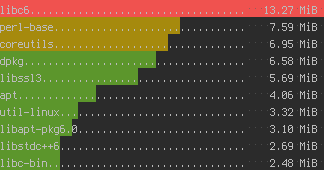

# pkgtop
Show largest installed packages

## Installation
```bash
$ curl https://raw.githubusercontent.com/SharUpOff/pkgtop/main/pkgtop.sh -so - | sudo tee /usr/local/bin/pkgtop > /dev/null
$ chmod 755 /usr/local/bin/pkgtop
```

## Usage
```bash
$ pkgtop 10
pycharm-professional............................................... 2029.62 MiB
android-studio..................................................... 1903.31 MiB
go.................................................................  409.08 MiB
enlightenment......................................................  404.20 MiB
libreoffice-fresh..................................................  402.01 MiB
jdk8...............................................................  346.40 MiB
llvm...............................................................  342.72 MiB
quickredis.........................................................  332.95 MiB
visual-studio-code-bin.............................................  284.89 MiB
google-chrome......................................................  264.33 MiB
```

The colour output makes it possible to compare installed packages visually:



# Platforms:
- Ubuntu/Debian
- ArchLinux
- OpenWRT
